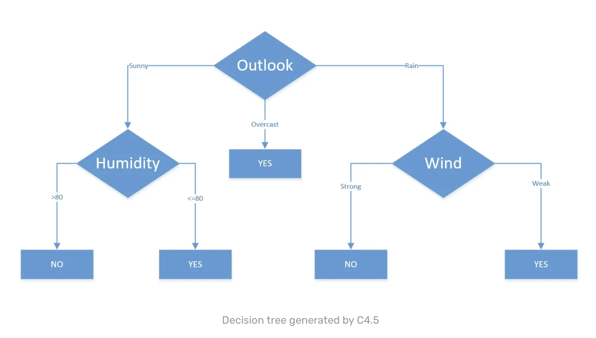

<!-- MathJax -->
<script type="text/javascript" src="https://cdnjs.cloudflare.com/ajax/libs/mathjax/2.7.3/MathJax.js?config=TeX-AMS-MML_HTMLorMML"> </script>
# Article 3 : Algorithmes pour identifer les champignons comestibles

> [Lien vers l'article](3_Compare_Prosiding-ICOIACT-Yogja.pdf)

## Résumé et résultats :

**But :** Identifier le meilleur algorithme pour la reconnaissance de champignons comestibles

La comparaison des **3 algos** se base sur :

- La fiabilité des résultats
- La vitesse d'exécution

Les algos comparés sont : 

- C4.5
- Naive Bayes 
- Support Vector Machine (SVM)

**Résultats :** 

L'algorithme **C4.5** est le plus fiable et le plus rapide.

|                      | C4.5 | Naive Bayes | SVM  |
| :------------------: | :--: | :---------: | :--: |
|      Fiabilité       | 100% |  95.8887 %  | 100% |
| Temps éxécution (ms) | 180  |     340     | 320  |

## Étude plus détaillée

### C4.5 :

#### Vu par l'article :

L'article nous apprend que le C4.5 est l'algorithme le plus efficace. Il fonctionne sous forme d'arbre de décision, on peut donc récupérer les catégories de triage les plus importantes selon l'algorithme :

- Odor
- Sport-print-color
- Gill-size
- Gill-spacing
- Population

#### Recherches complémentaires :

Cet algorithme est basé sur [l'algorithme ID3](ID3.md) et améliore ce dernier.  
Une mise à jour de cet algorithme (C5.0) permet d'améliorer entre autre la rapidité d'exécution.

**Fonctionnement :**

À partir d'une variable objectif (**variable prédite Y**) et de variable d'apprentissage (variables prédictives X). L'algorithme se base sue une mesure de l'entropie (cf Shannon) pour poduire un modèle. On constitue l'arbre de décision en calculant l'entropie du modèle pour extraire les caractères importants. Pour chacune des variables d'apprentissage, on peut calcul le **gain**. La variable avec le gain le plus important est un critère de choix dans la décision. Notons la catégorie de gain maximale A. Si seule cette catégorie permet de discriminer le résultat, on peut directement retourner une réponse. Sinon, on calcule le gain (l'entropie quelque part) des autres catégories sachant A. On répète l'opération jusqu'à avoir un arbre de décision.

Un peu de maths :

Ici d est la decision

Entropie de la source : 


$$
E_{dataSet}(d) = \sum p(d).log_2({1\over p(d)})
$$


Gain :


$$
G(d, variable) = E_{dataSet} - \sum p(variable)*E(d|variable)
$$


Split Info :


$$
SplitInfo(A) =  \sum {|D_i|\over |D|}.log_2({|D| \over |D_i|})
$$


Gain Ratio :


$$
GainRatio(A) = {Gain(A) \over SplitInfo(A)}
$$


*Exemple :*

L'exemple ci-dessous est une recopie du site [sefiks.com](https://sefiks.com/2018/05/13/a-step-by-step-c4-5-decision-tree-example/)

| Day  | Outlook  | Temp. | Humidity | Wind   | Decision |
| ---- | -------- | ----- | -------- | ------ | -------- |
| 1    | Sunny    | 85    | 85       | Weak   | No       |
| 2    | Sunny    | 80    | 90       | Strong | No       |
| 3    | Overcast | 83    | 78       | Weak   | Yes      |
| 4    | Rain     | 70    | 96       | Weak   | Yes      |
| 5    | Rain     | 68    | 80       | Weak   | Yes      |
| 6    | Rain     | 65    | 70       | Strong | No       |
| 7    | Overcast | 64    | 65       | Strong | Yes      |
| 8    | Sunny    | 72    | 95       | Weak   | No       |
| 9    | Sunny    | 69    | 70       | Weak   | Yes      |
| 10   | Rain     | 75    | 80       | Weak   | Yes      |
| 11   | Sunny    | 69    | 70       | Strong | Yes      |
| 12   | Overcast | 81    | 75       | Weak   | Yes      |
| 13   | Overcast | 81    | 75       | Weak   | Yes      |
| 14   | Rain     | 71    | 80       | Strong | No       |

On remarque que :


$$
p(Yes) = {9\over 14} \ ; \ p(No) = {5\over 14}
$$


On peut calculer l'entropie globale du dataset :


$$
E(d) = \sum p(d).log_2({1\over p(d)}) \\ =p(Yes).log_2({1\over p(Yes)})+p(No).log_2({1\over p(No)}) \\ = 0.940
$$


Par la suite, on calcule l'entropie en utilisant les catégories :

*Exemple avec le vent :*

Il n'y a que 2 possibilités : soit le vent est *Weak* soit il est *Strong*, on note W le vent et we pour Weak et st pour strong  


$$
E(d | W=we) = p(Yes|W=we).log_2({1\over p(Yes|W=we)})+p(No|W=we).log_2({1\over p(No|W=we)}) \\ = {2 \over 8}.log_2({8 \over 2})+{6 \over 8}.log_2({8 \over 6}) =0.811
\\
\\
E(d | W=st) = p(Yes|W=st).log_2({1\over p(Yes|W=st)})+p(No|W=st).log_2({1\over p(No|W=st)}) \\ = {3 \over 6}.log_2({6 \over 3})+{3 \over 6}.log_2({6 \over 3}) =1
$$


On peut maintenant calculer le gain pour l'attribut *Wind* :


$$
G(d, W) = 0.940 - ({8 \over 14}.0.811+{6 \over 14}.1)=0.049
$$


Enfin on calcule le GainRatio :


$$
GainRatio(d, W) = {8 \over 14}log_2({14 \over 8}) +{6 \over 14}log_2({14 \over 6}) = 0.049
$$


On peut suivre la même démarche pour *Outlook* puisque ce champ comporte 3 variables possibles : *Sunny*, *Overcast* ou *Rain*.

Pour *Temperature* ou *Humidity* c'est plus difficile puisque ce sont des valeurs. Il faut traduire ces attributs continus en attributs nominaux (ie. solution binaire). On peut prendre une valeur pivot et associer le caractère > ou < à notre pivot dans le dataset :

Ex: avec un pivot à 70, il y a  deux possibilités : >70 ou ≤ 70. 

On calcule l'entropie, le gain et le gainRatio de l'attribut en prenant chaque valeur comme pivot. Le bon pivot est celui qui offre une maximisatoin du gain.


On obtient finalement le tableau suivant : 

| Attribut         | Gain  | GainRatio |
| ---------------- | ----- | --------- |
| Wind             | 0.049 | 0.049     |
| Outlook          | 0.246 | 0.155     |
| Humidity <> 80   | 0.101 | 0.107     |
| Temperature <>83 | 0.113 | 0.305     |

En se basant sur le gain, l'attribut le plus important semble être *Outlook*. Toutefois, C4.5 semble privilégier le GainRatio ; on aurait alors la *Temperature* comme attribut le plus discriminant.

On discrimine alors notre dataset selon les variables possibles de l'attribut.

En décidant de se baser sur le Gain pour le choix de l'attribut, on obtient l'arbre de décision suivant :



> Source : [sefiks.com](https://sefiks.com/2018/05/13/a-step-by-step-c4-5-decision-tree-example/)

### Travail sur C4.5

Reprenons l'algorithme C4.5 sous python avec le même dataset d'étudié dans l'article.

Voici la réponse de l'algorithme :

```
                      feature  importance
4                        odor    0.908309
19          spore-print-color    0.062194
7                   gill-size    0.013199
6                gill-spacing    0.008099
3                     bruises    0.004500
16                 veil-color    0.003700
0                   cap-shape    0.000000
13     stalk-color-above-ring    0.000000
20                 population    0.000000
18                  ring-type    0.000000
17                ring-number    0.000000
15                  viel-type    0.000000
14    stalk-color-bellow-ring    0.000000
11   stalk-surface-above-ring    0.000000
12  stalk-surface-bellow-ring    0.000000
1                 cap-surface    0.000000
10                 stalk-root    0.000000
9                 stalk-shape    0.000000
8                  gill-color    0.000000
5            gill-attachement    0.000000
2                   cap-color    0.000000
21                    habitat    0.000000
```

On remarque que le critère de l'odeur est très important (90%); pas très pratique pour de la reconnaissance d'image … Je relance l'algorithme en gardant uniquement les critères utiles pour de la reconnaissance d'image.

```
                      feature  importance
17                  ring-type    1.578184
6                   gill-size    1.150070
18          spore-print-color    0.490902
9                  stalk-root    0.057588
3                     bruises    0.025195
0                   cap-shape    0.000000
11  stalk-surface-bellow-ring    0.000000
15                 veil-color    0.000000
14                  viel-type    0.000000
13    stalk-color-bellow-ring    0.000000
12     stalk-color-above-ring    0.000000
8                 stalk-shape    0.000000
1                 cap-surface    0.000000
7                  gill-color    0.000000
4            gill-attachement    0.000000
2                   cap-color    0.000000
16                ring-number    0.000000
10   stalk-surface-above-ring   -0.054189
5                gill-spacing   -0.794041
19                 population   -1.453709
```


### Naive Bayes :

Probabilité 
Le moins efficace des 3 algos étudiés

### Support Vector Machine (SVM) :

Plus obscur séparation par des hyperplans 
Tout aussi efficace que le C4.5 mais plus long

## Ressources à étudier :

- [Exemple sur C4.5](https://sefiks.com/2018/05/13/a-step-by-step-c4-5-decision-tree-example/)
- [Librairie et ressource sur C4.5](https://github.com/serengil/chefboost)
